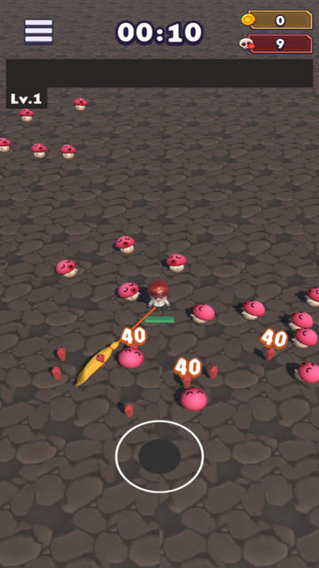
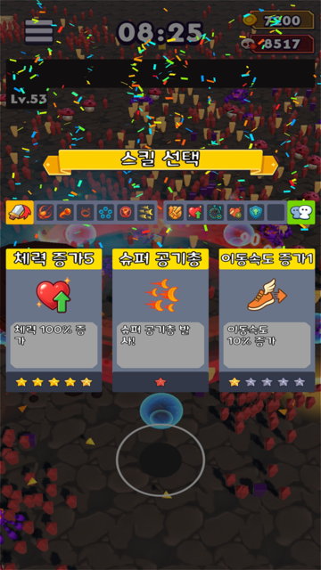

# 🧹 던전청소부 (Dungeon Cleaner)

> **3D 로그라이트 서바이벌 액션 게임 (Vampire Survivors-like)**
> 제한된 시간 동안 몰려오는 적을 처치하며 성장하고, 마지막 보스를 물리치는 게임

---

## 📌 프로젝트 개요

* **장르**: 3D 로그라이트 서바이벌 액션
* **플랫폼**: Android (Google Play Store 출시)
* **개발 기간**: 3주

  * 2025.09.12 ~ 2025.10.01
* **개발 인원**

  * 프로그래머 1명 (본인)
  * 기획자 2명
* **엔진 / 언어**

  * Unity / C#

---

## 🎮 게임 설명

`던전청소부`는 제한된 **10분** 동안 점점 강력해지는 적들을 처치하며
캐릭터를 성장시키고 **마지막 보스**를 처치하는 것이 목표인
**3D 로그라이트 서바이벌 게임**입니다.

* 무한히 이어지는 맵에서 끊임없이 등장하는 적
* 스킬, 아이템, 미니 상점을 통한 다양한 성장 전략
* 매 판마다 달라지는 빌드와 플레이 경험

---

## 🕹 주요 콘텐츠

### ▶ 전투 & 성장

* 플레이어 이동 및 전투 시스템
* 자동 공격 기반 스킬 시스템
* 레벨업 시 랜덤 스킬 선택
* 액티브 / 패시브 스킬 조합에 따른 빌드 변화

### ▶ 스킬 시스템

* **액티브 스킬 6종**

  * 발사체 3종
  * 오라 1종
  * 즉발형 1종
  * 위성형 1종
* **패시브 스킬 6종 구현**
* 스킬 강화 및 중첩 로직 구현
* 스킬별 데미지 누적 통계 시스템

### ▶ 적 & 보스

* 시간 경과에 따른 적 스폰 강화
* 다양한 적 행동 패턴
* 보스 전용 패턴 및 페이즈 구성

### ▶ 아이템 & 상점

* 드랍 아이템

  * 골드
  * 자석
  * 폭탄
  * 체력 회복
  * 경험치 보석
* 플레이 중 등장하는 **아이템 박스**
* 미니 상점을 통한 즉시 성장 선택

---

## 🧩 메타 시스템 (로비)

* 스테이지 선택
* 스탯 강화 시스템
* 장비 뽑기 / 강화 / 합성
* 인벤토리 관리 UI

---

## 💾 시스템 구현

* **JSON 기반 세이브 시스템**

  * 플레이어 성장 데이터 저장
  * 재화, 장비, 강화 상태 유지
* 사운드 시스템 적용 (BGM / SFX)
* 인게임 UI 및 로비 UI 전체 제작

---

## 🧑‍💻 담당 역할 (프로그래밍)

* 플레이어 조작 및 전투 로직 구현
* 적 스폰 시스템 및 행동 패턴 구현
* 무한 맵 구조 설계
* 레벨업 & 스킬 선택 시스템
* 아이템, 미니 상점, 보스 패턴 구현
* 메타 성장 시스템 (강화, 장비, 인벤토리)
* JSON 세이브 / 로드 시스템
* UI 구현 및 연동

---

## 🖼️ 스크린샷

> 게임 플레이 및 UI 예시

| 로비 | 전투 | 레벨업 |
|------|------|------|
|  |  |  |

---

## 🔗 링크

* Google Play Store: https://play.google.com/store/apps/details?id=com.Kyungil.DungeonCleaner
* 시연 영상: https://www.youtube.com/watch?v=skYi0BVwST8